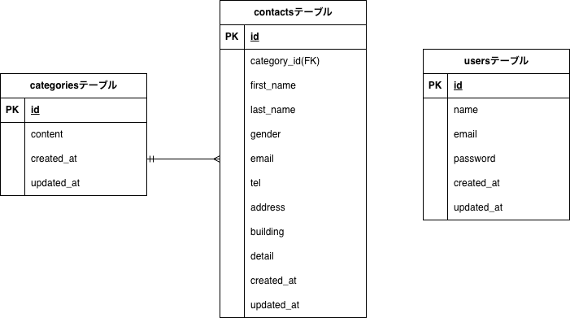

# お問い合わせフォーム（確認テスト）

本アプリケーションは Laravel 8 を使用して構築したお問い合わせ管理システムです。
フォーム送信、確認画面、サンクスページ、管理画面、検索機能、ページネーション、
ユーザー認証（Fortify）、ダミーデータシーディングなどが含まれています。

## 環境構築手順

### Docker の起動

docker compose up -d --build

### コンテナへ入る

docker compose exec php bash

### Composer インストール

composer install

### .env 設定

`.env.example` をコピーして `.env` を作成
cp .env.example .env
php artisan key:generate

### マイグレーション & シーディング

php artisan migrate:fresh --seed

## 使用技術

- Laravel 8.x
- PHP 8.x
- MySQL
- Docker (Laravel Sail)
- Blade
- CSS

---

## ER図

## ページ一覧

| 画面名               | URL              |
| -------------------- | ---------------- |
| お問い合わせフォーム | /contact         |
| 確認ページ           | /contact/confirm |
| サンクスページ       | /contact/thanks  |
| 管理画面             | /admin           |
| ログイン             | /login           |
| ユーザー登録         | /register        |

---

## ディレクトリ構成（主要部分）

src/
├── app/
│   ├── Actions/
│   │   └── Fortify/
│   │       ├── CreateNewUser.php
│   │       ├── LoginRequest.php
│   │       └── RegisterRequest.php
│   │
│   ├── Http/
│   │   ├── Controllers/
│   │   │   ├── AdminController.php
│   │   │   ├── FormController.php
│   │   │   └── Auth/
│   │   │       ├── LoginController.php
│   │   │       └── RegisterController.php
│   │   │
│   │   └── Requests/
│   │       ├── ContactRequest.php
│   │       ├── LoginRequest.php
│   │       └── RegisterRequest.php
│   │
│   ├── Models/
│   │   ├── Category.php
│   │   ├── Contact.php
│   │   └── User.php
│   │
│   └── Providers/
│       └── FortifyServiceProvider.php
│
├── resources/
│   ├── views/
│   │   ├── contact/
│   │   │   ├── index.blade.php
│   │   │   ├── confirm.blade.php
│   │   │   └── thanks.blade.php
│   │   │
│   │   ├── admin/
│   │   │   └── index.blade.php
│   │   │
│   │   └── auth/
│   │       ├── login.blade.php
│   │       └── register.blade.php
│   │
│   └── css/
│       ├── admin.css
│       ├── app.css
│       ├── confirm.css
│       ├── index.css
│       ├── login.css
│       ├── register.css
│       ├── sanitize.css
│       └── thanks.css
│
├── public/
│   └── images/
│       └── contact-form-test.drawio.png
│
├── database/
│   ├── migrations/
│   │   ├── 2014_10_12_create_users_table.php
│   │   ├── 2025_11_04_create_categories_table.php
│   │   └── 2025_11_05_create_contacts_table.php
│   │
│   ├── factories/
│   │   └── ContactFactory.php
│   │
│   └── seeders/
│       ├── CategorySeeder.php
│       └── ContactSeeder.php
│
├── routes/
│   └── web.php
│
├── docker-compose.yml
├── .env
└── README.md

## メモ

- 動作確認済
- バリデーション OK
- フォーム送信 → 確認 → 完了の流れ OK
- 管理画面検索・リセット OK
- ログイン/ログアウト OK
- CSVエクスポート OK

## 機能一覧

- お問い合わせフォーム（バリデーションあり）
- 確認画面 → サンクスページの流れ
- 管理画面（ログイン必須）
- 検索機能（名前/メール/性別/種類/日付）
- 検索結果の保持
- リセット機能
- ページネーション（7件ずつ）
- 詳細モーダル表示
- 削除機能（モーダル内）
- CSVエクスポート（応用機能）