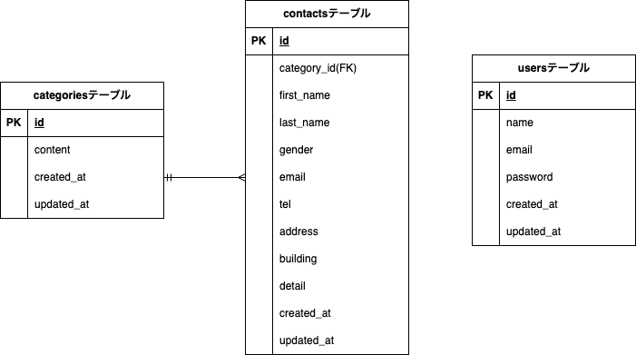

# お問い合わせフォーム
```
本アプリケーションは Laravel 8 を使用して構築したお問い合わせ管理システムです。
ユーザー側ではお問い合わせフォーム、確認・サンクスページ、登録画面、ログイン機能を提供し、管理者側では問い合わせ一覧表示、詳細モーダル、削除機能、ダミーデータシーディング、CSV エクスポートなどを実装しています。
ユーザー管理には Laravel Fortify を使用しています。
```
> ## ⚠ 本アプリの位置づけと設計上の前提
>
> COACHTECHの課題要件（会員登録・ログイン・管理画面）に基づく**学習用の実装**です。
> 要件上、**ログインできるユーザー＝管理者**という設計になっており、
> 会員登録は誰でも行えます。そのため管理画面の問い合わせ一覧・CSV出力は
> 「登録すれば誰でも閲覧できる」状態です。
>
> これは要件どおりの実装ですが、**そのまま公開すると全員の氏名・メール・
> 電話番号・住所が閲覧できる**ことになります。本リポジトリは
> **ローカルでの動作確認用**とし、インターネット上には公開しません。
>
> 実運用するなら、利用者と管理者の権限を分離（`users.is_admin` 等）し、
> 管理画面を権限で絞る必要があります。

## 環境構築

### 1. リポジトリをクローン
```
git clone https://github.com/yurinaniko/contact-form-test.git
cd contact-form-test
```
### 2. Docker の起動

docker compose up -d --build

### 3. コンテナへ入る

docker compose exec php bash

### 4. Composer インストール

composer install

### 5. .env 設定

`.env.example` を `.env` としてコピーします：

### 6. APP_KEY の生成

php artisan key:generate

### 7. マイグレーション & シーディング

php artisan migrate:fresh --seed

### 8. サーバーを確認

ブラウザで以下へアクセス：

http://localhost:8000

### 管理画面ログイン方法

Fortify を利用しているため、通常の Laravel のログインページからログインします。
推奨：シーディングで管理ユーザーを登録
```
Seeder で admin ユーザーを作成している場合：
メール: admin@example.com
パスワード: password
```
## 使用技術
```
- Laravel 8.83.x
- PHP 8.1
- MySQL 8.0.26
- Docker (Laravel Sail)
- Blade
- CSS
```

## ER 図



## ページ一覧
```
| 画面名               | URL                |
| -------------------- | ------------------ |
| お問い合わせフォーム | /contact           |
| 確認ページ           | /contact/confirm   |
| サンクスページ       | /contact/thanks    |
| 管理画面             | /admin             |
| ログイン             | /login             |
| ユーザー登録         | /register          |
```
## ディレクトリ構成（主要部分）
```
src/
├── app/
│ ├── Actions/
│ │ └── Fortify/
│ │ ├── CreateNewUser.php
│ │ ├── LoginRequest.php
│ │ └── RegisterRequest.php
│ │
│ ├── Http/
│ │ ├── Controllers/
│ │ │ ├── AdminController.php
│ │ │ ├── FormController.php
│ │ │ └── Auth/
│ │ │ ├── LoginController.php
│ │ │ └── RegisterController.php
│ │ │
│ │ └── Requests/
│ │ ├── ContactRequest.php
│ │ ├── LoginRequest.php
│ │ └── RegisterRequest.php
│ │
│ ├── Models/
│ │ ├── Category.php
│ │ ├── Contact.php
│ │ └── User.php
│ │
│ └── Providers/
│ └── FortifyServiceProvider.php
│
├── resources/
│ ├── views/
│ │ ├── contact/
│ │ │ ├── index.blade.php
│ │ │ ├── confirm.blade.php
│ │ │ └── thanks.blade.php
│ │ │
│ │ ├── admin/
│ │ │ └── index.blade.php
│ │ │
│ │ └── auth/
│ │ ├── login.blade.php
│ │ └── register.blade.php
│ │
│ └── css/
│ ├── admin.css
│ ├── app.css
│ ├── confirm.css
│ ├── index.css
│ ├── login.css
│ ├── register.css
│ ├── sanitize.css
│ └── thanks.css
│
├── public/
│ └── images/
│ └── contact-form-test.drawio.png
│
├── database/
│ ├── migrations/
│ │ ├── 2014_10_12_create_users_table.php
│ │ ├── 2025_11_04_create_categories_table.php
│ │ └── 2025_11_05_create_contacts_table.php
│ │
│ ├── factories/
│ │ └── ContactFactory.php
│ │
│ └── seeders/
│ ├── CategorySeeder.php
│ └── ContactSeeder.php
│
├── routes/
│ └── web.php
│
├── docker-compose.yml
├── .env
└── README.md
```
## メモ

- 動作確認済
- バリデーション OK
- フォーム送信 → 確認 → 完了の流れ OK
- 管理画面検索・リセット OK
- ログイン/ログアウト OK
- CSV エクスポート OK

## 機能一覧

### ユーザー側

- お問い合わせフォーム -> 名前 / 性別 / メール / 電話番号 / 住所などの入力

- バリデーションエラー表示

- 確認画面（送信または修正ボタンクリック）
  修正->お問い合わせフォームに戻る
  送信->サンクスページに遷移

- サンクスページ表示

### 管理者側

- 登録画面にて Fortify を使用し、管理画面にアクセスできる新規ユーザーを作成（名前、メールアドレス、パスワード入力）

- ログイン画面 -> メールアドレス / パスワード入力

- 管理画面（ログイン必須）

- 検索機能（名前/メール/性別/種類/日付）

- 検索結果の保持

- リセット機能

- ページネーション（7 件ずつ）

- 詳細モーダル表示

- 削除機能（モーダル内）

- CSV エクスポート（動作確認済み）

### 使用フォント

font-family: 'Inika', 'Hiragino Sans', 'Hiragino Kaku Gothic ProN', Meiryo, sans-serif;

### 備考
```
## Apple Silicon(M1/M2/M3/M4) Macについて

Apple Silicon環境では、DockerイメージのCPUアーキテクチャ互換性により
`no matching manifest for linux/amd64 in the manifest list entries`
エラーが発生する場合があります。

本アプリでは以下の対応を行っています。

- MySQL に `platform: linux/x86_64` を指定
- phpMyAdmin は `arm64v8/phpmyadmin:latest` を使用

これにより Apple Silicon Mac 環境でも動作可能です。
```
### URL
```
- ユーザー画面： http://localhost:8000/

- 管理者画面： http://localhost:8000/admin
  ※ 新規登録し、ログイン後に管理者画面表示されます

- phpMyAdmin： http://localhost:8080/
```

